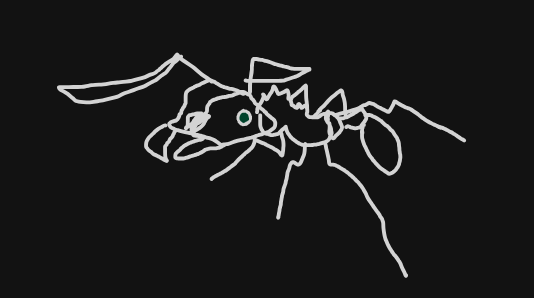

# leafcutter-ant



**leafcutter-ant is a Rust port of the Dash compiler that bridge. uses for
Minecraft Bedrock add-ons: the same project in, the same bytes out.**

It ports `@bridge-editor/dash-compiler` 0.13.0 ("TS Dash") and keeps its
interfaces: the plugin hooks, `config.json`, the `.bridge/.dash.<mode>.json`
cache, and every byte of output. TS Dash is the specification; where it does
something odd that a project can observe, leafcutter-ant does the same odd
thing and lists it in the quirk ledger below. The plan, milestones and open
questions are in `PRD-native-dash-compiler.md` next to this repository.

It builds projects whose plugins are the built-ins that need no
JavaScript: `simpleRewrite`, `rewriteForPackaging`, `entityIdentifierAlias`,
`formatVersionCorrection`, `floatPropertyTruncationFix`, `contentsFile` and
`typeScript`. The built-ins that run user JavaScript (`moLang`, the custom
components, `customCommands`, `generatorScripts`) and plugins from extensions
need an embedded JavaScript runtime, which comes next; until then a plugin
list that names one gets an error on the console for it and the build goes
on without it. Hot updates and `watch` come after that.

The library's runtime dependencies are `indexmap`, `ryu-js`, `regress`,
`futures-util`, `swc`, `swc_common`, `serde_json` and `rquickjs`, each with
its reason in `Cargo.toml`, and it does nothing until it is called. `Cargo.lock` holds swc
and the crates around it at the versions swc 1.6.5 was released with; do not
let `cargo update` move them.

## leafcutter-ant is not for you if you

- need JavaScript plugins, Molang functions, custom components, custom
  commands or generator scripts today, or a watch mode. Use TS Dash, through
  [deno-dash-compiler](https://github.com/bridge-core/deno-dash-compiler) or
  the bridge. editor.
- want features TS Dash does not have. Nothing new goes in until the output
  matches TS Dash on the whole parity corpus, and TS Dash's known quirks stay
  until then too.
- want to write compiler plugins in Rust. Plugins stay JavaScript modules, as
  in TS Dash.

## How it works

Parity is measured against the JavaScript that TS Dash runs, not described.
`tools/parity` pins that JavaScript (TS Dash 0.13.0 and every package it
loads, at the versions TS Dash's lockfile resolves, and Node through
`.nvmrc`) and records golden vectors from it into
`crates/leafcutter-ant/tests/vectors/`:

| Vectors | Recorded from |
| --- | --- |
| `numbers.json` | V8's `JSON.stringify` of hand-picked and random f64 values |
| `stringify.json` | V8's `JSON.stringify` of random documents, compact and tab-indented |
| `json5.json` | json5 2.2.1's `parse` of edge cases, random json5 and damaged json5: results and error messages |
| `paths.json` | the functions of pathe 2.0.2 (which Dash imports) and pathe 1.1.2 (which mc-project-core imports) that each calls, on edge cases and random paths |
| `typescript.json` | @swc/wasm-web 1.6.5 on the sources in `tools/parity/typescript/`, with the options Dash's `typeScript` plugin passes, with and without inline source maps |
| `globs.json` | the picomatch that common-utils vendors: the regex source it builds for every file definition matcher, the float fix's globs and random globs, whether V8 compiles that source, and `isMatch` on paths built to match and paths that should not |
| `is-glob.json` | is-glob 4.0.3 on the same globs and on random strings |
| `plugins.json` | TS Dash's own `entityIdentifierAlias` and `floatPropertyTruncationFix`, taken out of a real setup and called hook by hook, for input the non-JavaScript corpus cannot give them because no built-in there reads the files they look at |
| `project.json` | mc-project-core 0.5.0 with the vendored definitions: pack roots and pack and file type detection for regular and malformed project configs, with picomatch as the matcher (as the Deno CLI sets it up) and with a matcher that never matches (as the editor does) |

The Rust tests compare against every vector. `tools/parity/corpus.mjs` also
builds each project under `crates/leafcutter-ant/tests/corpus/` with TS Dash
itself, four ways (production and development, each with and without a
separate output file system, as the Deno CLI's `--out` gives one), and
records what every build wrote, removed and output in
`<project>.expected.json`; `tests/corpus.rs` builds the same projects with
leafcutter-ant and compares. CI records the vectors and the corpus again and
fails if the committed copies differ, so the files cannot drift from what the
JavaScript does. To record them yourself:

```sh
cd tools/parity
npm ci
npm run vectors
```

`src/json/json5_unicode.rs` comes from the same run: json5 carries its own
Unicode 10 tables for unquoted keys, and they are copied out of json5 rather
than taken from a newer Unicode release.

The host owns the disk and the terminal. leafcutter-ant reads a project and
writes its output through the `fs::FileSystem` trait, a port of TS Dash's
`FileSystem`, and reports through a `console::Console` the host supplies. The
trait is async: its methods return boxed futures that are not `Send`, and
the library picks no executor, so the CLI can block on them, the desktop app
can run them on a single-threaded runtime, and a browser host can back them
with a page's async file APIs. `fs::NativeFileSystem` is the local disk. It
lists directories sorted by name, writes through a temporary file that is
renamed over the target, and blocks the thread that polls it.

## Quick start

```sh
git clone https://github.com/Smiduweorc/leafcutter-ant
cd leafcutter-ant
scripts/tasks.sh test
```

The library, as a dependent crate sees it (this block runs as a test):

```rust
use leafcutter_ant::json::{Indent, parse_json5, stringify};

let value = parse_json5("{b: 1, '1': .5, a: [0x10, +Infinity], // note\n}")?;
assert_eq!(stringify(&value, Indent::None), r#"{"1":0.5,"b":1,"a":[16,null]}"#);
assert_eq!(
	stringify(&value, Indent::Tab),
	"{\n\t\"1\": 0.5,\n\t\"b\": 1,\n\t\"a\": [\n\t\t16,\n\t\tnull\n\t]\n}"
);

let error = parse_json5("{a: 1,,}").unwrap_err();
assert_eq!(error.to_string(), "JSON5: invalid character ',' at 1:7");
# Ok::<(), leafcutter_ant::json::Json5Error>(())
```

`cargo doc --open` builds the API reference.

To build a project, run `leafcutter build` in its folder, with the Deno
CLI's flags:

```sh
cargo build --release
cd path/to/project
path/to/leafcutter-ant/target/release/leafcutter build --mode development --out ./out
```

`--mode` is `production` unless given, `--out` writes into a separate folder
the way a `com.mojang` folder is written (`preview` names Minecraft
Preview's, and in development mode the default is Minecraft's own where
`APPDATA` is set), `--compilerConfig` takes the plugin list from another
file, and `--noCache` empties the cache first. The project config is
`dash-config.json` when that file exists, else `config.json`. The pack and
file definitions come from bridge-core/editor-packages and are kept in
`~/.dash`, which a build empties once it is more than a day old, as the Deno
CLI does. The exit code is 0 for a build, 1 when the build could not run,
and 2 for arguments it does not understand.

## Quirk ledger

Behaviour kept from TS Dash because projects can observe it, bugs included.
Each row is pinned by a test that cites the TS source. None is fixed before
parity has shipped; after that, each fix lands as its own commit on a
separate branch, and this table is that branch's checklist.

| Quirk | What TS Dash does | Pinned by |
| --- | --- | --- |
| `"__proto__"` keys vanish | json5 2.2.1 assigns `parent[key] = value`, which sets the prototype instead of adding a key | `a_proto_key_never_becomes_a_property`, `json5.json` |
| Index-like keys move to the front | JavaScript objects list `"0"` to `"4294967294"` first, ascending: `{"b":1,"1":2}` is written `{"1":2,"b":1}` | `index_keys_iterate_first_in_numeric_order_then_the_rest_in_insertion_order`, `stringify.json` |
| `NaN` and `Infinity` are written as `null` | json5 reads them; `JSON.stringify` writes `null` | `nan_and_the_infinities_are_written_as_null` |
| Error columns count UTF-16 units | json5 counts code units, and only `\n` starts a line | `the_position_is_the_column_after_the_offending_character`, `json5.json` |
| An invalid escaped key character is reported 5 columns back | json5 subtracts 5 from the column | `an_escaped_key_character_that_cannot_be_in_a_key_reports_five_columns_back` |
| A project config whose `compiler` is `null` stops the build | `isCompilerActivated` checks `compiler !== undefined`, then reads `compiler.plugins` and throws (`Dash.ts`) | `a_null_compiler_stops_the_build_as_the_type_error_does_in_ts_dash` |
| A plugin list entry named like a property of `Object.prototype`, such as `constructor`, fails as an extension plugin | the extension plugin map is a plain object, so `plugins["constructor"]` finds the inherited function and Dash tries to run it as a module (`AllPlugins.ts`) | `plugin_list_entries_name_builtins_and_unknown_or_javascript_plugins_are_reported` |
| A plugin that ignores a file drops every plugin with the same id from that file's hooks | `createImplementedHooksMap` filters by plugin id, and a plugin listed twice has one id (`DashFile.ts`) | `a_plugin_that_ignores_a_file_is_left_out_of_its_per_file_hooks_by_id` |
| A `load` or `transform` chain that ends in `null` keeps the data it started with, even after a plugin replaced it | the chain's result goes through `?? file.data` (`LoadFiles.ts`, `TransformFiles.ts`) | `load_and_transform_chains_fall_back_to_the_start_when_they_end_in_null` |
| Virtual files an `include` hook adds come before every pack file, in processing and in the cache file | `loadAll` adds `[path, { isVirtual }]` entries at once and the pack files afterwards (`IncludedFiles.ts`) | `included_virtual_files_come_first_and_included_paths_after_the_packs` |
| A failed copy or write leaves the file out of the output with no message | `Promise.allSettled` over the copies and writes, results unread (`LoadFiles.ts`, `TransformFiles.ts`) | `failed_writes_and_copies_are_silent_as_in_ts_dash` |
| A plugin option named `mode` or `buildType` replaces the live value, for that plugin only | the options object is `{ get mode(), get buildType(), ...pluginOpts }`, so the spread overwrites the getters (`AllPlugins.ts`) | `a_plugin_option_named_mode_replaces_the_build_mode_for_that_plugin` |
| `simpleRewrite` clears the default pack folder before a build, never the one `packNameSuffix` names, so output under a suffix piles up | `buildStart` unlinks `<packName> <defaultPackPath>` (`SimpleRewrite.ts`) | `a_full_build_clears_the_default_pack_folder_but_not_a_suffixed_one` |
| A block, item or fog file that json5 cannot read, or that reads as `null`, is copied as it is | `formatVersionCorrection`'s `read` catches the error, logs it on the global console and returns nothing (`FormatVersionCorrection.ts`) | `every_corpus_project_builds_as_ts_dash_builds_it` (`format-version`) |
| A `format_version` named like a property of `Object.prototype` drops the key, or turns it into `{}` for `__proto__` | `formatVersionMap[version]` looks in a plain object and finds the inherited function, which `JSON.stringify` leaves out (`FormatVersionCorrection.ts`) | `every_corpus_project_builds_as_ts_dash_builds_it` (`format-version`) |
| `floatPropertyTruncationFix` fixes the first float property of a `player.json` and misses the rest | its `JSON.stringify` replacer pushes the key of every object it enters and never pops it, so later paths carry every key visited before (`FloatPropertyTruncationFix.ts`) | `finalize_build_and_its_console_lines_match_ts_dash` |
| A float that prints with an exponent, or as `NaN` or `Infinity`, is written as the marker string `"$___dash___floatPropertyTruncationFix___..."` | the marker is replaced by a regular expression that accepts only digits, `.` and `-` | `finalize_build_and_its_console_lines_match_ts_dash` |
| That marker, written by the project itself anywhere in a `player.json`, is replaced too | the replacement runs over the whole output | `a_marker_is_replaced_only_when_digits_dots_and_minus_signs_follow` |
| Every entity whose path ends in `player.json`, `myplayer.json` included, is written tab-indented; other entity files are handed on unchanged, which keeps any later `finalizeBuild` plugin from seeing them | `finalizeBuild` tests `endsWith("player.json")` and returns `fileContent` for other entities | `finalize_build_and_its_console_lines_match_ts_dash` |
| The float fix logs the path of every value in a `player.json`, and every glob test on a number | `console.log` inside the replacer | `finalize_build_and_its_console_lines_match_ts_dash` |
| `contentsFile` writes every file of a pack as the pack's file list and never writes `contents.json` | `read` and `finalizeBuild` return early for `contents.json` instead of for every other file (`ContentsFile.ts`) | `every_corpus_project_builds_as_ts_dash_builds_it` (`contents-file`, `contents-then-rewrite`, `float-fix-then-contents`) |
| The list holds the path each `transformPath` call was given, `contents.json` included; a file an earlier plugin already moved out of the pack is left out | `transformPath` pushes its argument and looks up the pack by it | `every_corpus_project_builds_as_ts_dash_builds_it` (`rewrite-then-contents`) |
| Every build in a session appends the whole pack to the list again | the list is filled in `transformPath` and never emptied, and plugins live from setup to setup | `every_build_in_a_session_appends_the_whole_pack_again` |
| A `.ts` file swc refuses is written to its `.js` path as the TypeScript source | the `load` hook throws, the host catches it, the data stays the source text, and `finalizeBuild` returns any string (`TypeScript.ts`) | `every_corpus_project_builds_as_ts_dash_builds_it` (`typescript`) |
| A `~/.dash/.timestamp` that is not a number keeps the cache forever | `parseInt` gives NaN, and `now - NaN > day` is false (`LocalCache.ts`) | `a_timestamp_that_is_not_a_number_never_expires` |
| A required file that does not exist is skipped without a message | `resolveSingle` reports an undefined dependency only for an entry `query` never returns (`ResolveFileOrder.ts`) | `the_cache_file_lists_every_file_with_aliases_requirements_and_update_files` |

Where leafcutter-ant differs from TS Dash, and why:

| Difference | TS Dash | leafcutter-ant | Why |
| --- | --- | --- | --- |
| A `\u` escape that leaves a lone surrogate, or a config whose `packs` is a string split between the halves of a surrogate pair | keeps it, writes `"\udXXX"` | U+FFFD | Rust strings cannot hold a lone surrogate |
| Tab-indented output nested more than about 4,000 deep | V8 throws `RangeError` | writes it | the writer does not recurse |
| The console lines of `floatPropertyTruncationFix` and the parse errors of `formatVersionCorrection` | go to the global `console` | go to the host's `Console` | a library does not print |
| `leafcutter build` start-up | checks GitHub for a newer release and downloads the swc WebAssembly module | neither | the release check is a network call nobody asked for, and swc is compiled in |
| Cached definitions in `~/.dash` | read with `JSON.parse` | read with the json5 reader | the cache is written by the tool itself as plain JSON, which both read alike |
| U+2028 or U+2029 inside a json5 string | json5 prints a warning to the console | reads it silently | a library does not print |
| A `"__proto__"` key in a file the Deno CLI reads through its own `FileSystem.readJson` | that path uses json5 2.2.3, which keeps the key | drops it | leafcutter-ant reads json5 as 2.2.1 everywhere, as the plugins inside Dash do |
| File or pack definitions that are not an array of objects with a string `id` | takes them and fails later, where a plugin asks for a file type | refused when the host builds `FileTypes` or `PackTypes` | the definitions come from the host, which can report them at startup |
| A plugin reading a key an object lacks, where the object has a `"__proto__"` key | json5 2.2.1 makes the `"__proto__"` value the object's prototype, so the lookup finds the key there | the key is dropped and no prototype is kept, so the lookup finds nothing | JSON values here have no prototypes; modelling them is an open question (pinned by `a_proto_key_gives_the_file_no_inherited_format_version`) |
| The order `read`, `load` and `registerAliases` hooks see files in | the order the files' reads finish | build order, with the reads still running concurrently | output must not depend on timing; it shows where two files register one alias, and the later one in build order owns it |
| Two files with the same output path | both writes run at once and either may land last | the later file in build order wins | the same |
| A copied file and a written file with the same output path | the copy starts first and usually lands first | copies finish before any write starts, so the written file wins | the same |
| Two extensions that declare the same compiler plugin id | the manifest read last wins | the manifest listed last wins | the same |
| The order of a directory listing | the operating system's, through Deno's `readDir` | sorted by the bytes of each name | the listing order becomes the order of contents lists and of the cache file, and must not change from one machine to the next |
| pathe's `resolve` and `relative` on a path that climbs above the working directory | resolved against `process.cwd()` in the Deno CLI and against `/` in the editor | resolved against `/` | the result then depends on no process state; relative paths that stay below the working directory give the same answer either way |

## Tasks

| Task | What it does |
| --- | --- |
| `just setup` | Install the toolchain, dependencies and git hooks |
| `just fmt` | Format sources in place |
| `just lint` | `cargo fmt --check`, clippy with warnings as errors, and the API docs build; changes nothing |
| `just test` | Unit, integration and doc tests for the whole workspace |
| `just build` | Release build of every crate |
| `just changelog` | Regenerate `CHANGELOG.md` from the commit history |
| `just release v1.2.3` | Cut a release (or `patch`, `minor`, `major`) |
| `just preflight` | `lint` + `test`, as run before a release |
| `just hooks` | (Re)install the git hooks |
| `just clean` | `cargo clean` |
| `just help` | List the tasks |

Every one of these is a thin wrapper around `scripts/tasks.sh <task>`. That
file is the single definition of what each task means; `just`, the git hooks
and CI all call into it, so they cannot drift apart. Every cargo call passes
`--locked`, so a `Cargo.lock` that is out of date fails the task instead of
being rewritten. Recording the golden vectors needs Node, so it is the
`vectors` script in `tools/parity/package.json` instead.

`just setup` needs [mise](https://mise.jdx.dev) (for just, lefthook,
git-cliff and commitlint-rs) and [rustup](https://rustup.rs). Before just
exists, run `scripts/tasks.sh setup`. commitlint-rs has no release binaries
for the pinned version, so the first `mise install` builds it with cargo.

## Releasing

```sh
just release v1.2.3          # or: patch | minor | major
PUSH=1 just release patch    # also push the branch and the tag
```

`release.sh` refuses to run off `master` or on a dirty tree, runs `preflight`,
sets the version in `[workspace.package]` of `Cargo.toml` (every crate
inherits it) and refreshes `Cargo.lock`, regenerates `CHANGELOG.md`, commits
as `chore(release): prepare for <tag>`, and creates an annotated tag whose
message is that release's changelog. Publishing is manual; every crate has
`publish = false`.

## Commits

Commit messages follow [Conventional Commits][cc]. `scripts/commit-msg.sh`
checks them in the commit-msg hook, and git-cliff builds `CHANGELOG.md` from
them. Dependabot's bumps are `chore(deps): ...`, which the changelog skips.

Because `.commitlintrc.yml` exists, the hook hands the message to
[commitlint-rs][clrs] (pinned in `mise.toml`) with the rules in that file, and
still refuses a subject line over 100 characters, which commitlint-rs has no
rule for. Without commitlint-rs on `PATH` it falls back to its own regex,
which accepts the same types.

[cc]: https://www.conventionalcommits.org
[clrs]: https://github.com/KeisukeYamashita/commitlint-rs

## Files shared with black-garden-ants

`release.sh`, `cliff.toml`, `lefthook.yml`, `scripts/commit-msg.sh`,
`.editorconfig`, the issue templates, and the head and tail of
`scripts/tasks.sh` are copies of black-garden-ants' `src/core`.
`scripts/check-shared.sh` compares them byte for byte, and the
**Shared files** workflow runs it on every push and every Monday. To change
one of them, change it in black-garden-ants first, then copy it here.

## Layout

| Path | Purpose |
| --- | --- |
| `crates/leafcutter-ant/` | The library: everything the compiler does |
| `crates/leafcutter-ant/tests/vectors/` | Golden vectors recorded by `tools/parity` |
| `crates/leafcutter-ant/tests/corpus/` | Small projects for the parity harness, each next to the output TS Dash gave for it |
| `crates/leafcutter-ant/tests/data/` | `fileDefinitions.json` and `packDefinitions.json` from bridge-core/editor-packages at commit `10e360dc`, the data TS Dash fetches at run time |
| `crates/leafcutter-ant-cli/` | The `leafcutter` binary: arguments in, library call, output out, and the `~/.dash` cache |
| `assets/logo.png` | The logo, drawn by grml |
| `tools/parity/` | The pinned JavaScript that records the vectors, json5's tables and the corpus output |
| `Cargo.toml` | Workspace members, the shared version, and the lint levels |
| `rust-toolchain.toml` | The pinned Rust release, with rustfmt and clippy |
| `rustfmt.toml` | Tabs, and the edition rustfmt uses when the hook calls it directly |
| `mise.toml` | just, lefthook, git-cliff and commitlint-rs |
| `.commitlintrc.yml` | The commitlint-rs rules the commit-msg hook applies |
| `scripts/tasks.sh` | What every task means. Edit the Rust part to change behaviour. |
| `scripts/check-shared.sh` | The black-garden-ants comparison |
| `release.sh`, `cliff.toml`, `lefthook.yml`, `scripts/commit-msg.sh` | Shared release flow, changelog rules, hooks and commit check |
| `LICENSE` | Dash's MIT licence, which leafcutter-ant is released under |
| `NOTICE.md` | The licence notices for the code ported here and the vendored test data |

## Lints

`unsafe_code` is forbidden in every crate, and missing docs, `dbg!`, `todo!`
and `unimplemented!` warn, which `just lint` turns into errors. The library
also denies printing to stdout or stderr: it returns values and the host
decides what to show.

## Known quirks

- The Rust release is pinned in two places that must agree: `channel` in
  `rust-toolchain.toml` and `rust-version` in `Cargo.toml`. Raise them
  together by hand.
- The edition is in both `Cargo.toml` and `rustfmt.toml`, because the
  pre-commit hook runs rustfmt on staged files without Cargo.
- rustfmt also formats the out-of-line modules a staged file declares, so the
  hook can change a file you did not stage. It stages only what was already
  staged.
- Dependabot does not watch `tools/parity`: its pins must stay the versions
  TS Dash 0.13.0 resolves.

## Licence

MIT: Dash's licence, in `LICENSE`, since leafcutter-ant is a port of it.
`NOTICE.md` holds the notices for the code ported from other MIT projects.
